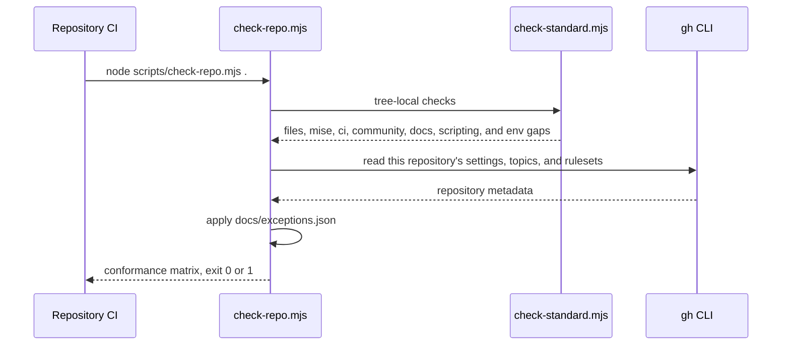
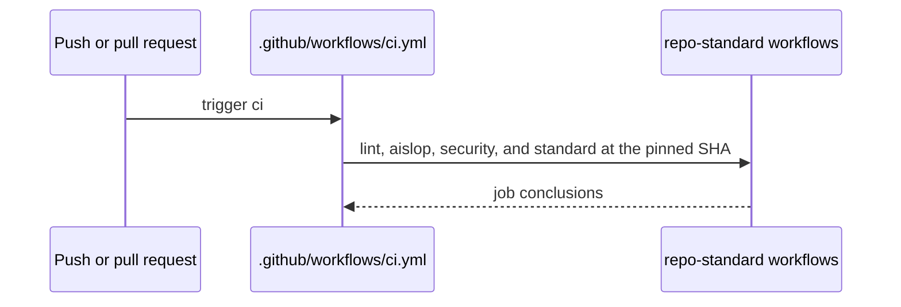

# Architecture

## Self-conformance check

Every repository checks itself. There is no cross-repository audit and no
organization-wide token. `scripts/check-standard.mjs` reads the working tree against
the pinned standard, and `scripts/check-repo.mjs` adds the checks a repository can
make about itself through the GitHub API, then applies the exception file.

## Reusable workflow consumption

A consuming repository calls the reusable workflows at a pinned commit of this
repository. The called workflow runs in the consuming repository and reads only that
repository, with the consuming repository's own token.

