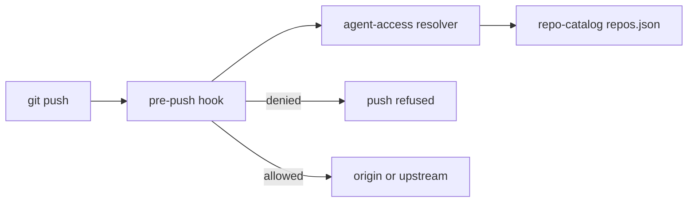

# Agent access

Agent access answers one question for one repository. How much may an AI agent do
against it? The policy is intent, and it lives in
[`repo-catalog`](https://github.com/simpsonm09-org/simpsonm09-repo-catalog). The
resolver and the push guard live here, because the standard owns enforcement.

## The level

`repos.json` carries a default per tier in `agentAccessDefaults` and an optional
`agentAccess` override on a repository. The effective level is the override when
present, otherwise the tier default. The levels, strictest first, are `none`,
`read`, `propose`, `merge`, and `full`.

## Capabilities

An enforcement point never asks for a level. It asks whether the repository grants a
capability, so the mapping from the policy to a decision lives in one table in
[`../../scripts/agent-access.mjs`](../../scripts/agent-access.mjs).

| Level | Grants |
| --- | --- |
| `none` | Nothing. |
| `read` | `read` |
| `propose` | `read`, `pushBranch`, `openPr` |
| `merge` | `read`, `pushBranch`, `openPr`, `mergePr` |
| `full` | `read`, `pushBranch`, `openPr`, `mergePr`, `pushMain`, `admin` |

## The resolver

[`../../scripts/agent-access.mjs`](../../scripts/agent-access.mjs) reads the catalog
and resolves one repository.

```bash
node scripts/agent-access.mjs simpsonm09-repo-catalog              # prints the level
node scripts/agent-access.mjs simpsonm09-browser-calculator --json # prints the level, tier, and source
node scripts/agent-access.mjs simpsonm09-repo-catalog --allows pushMain  # exits 1 when denied
```

The `--allows` mode exits `0` when the level grants the capability and `1` when it
does not, so a shell caller branches on the exit code.

## The command classifier

`--command` classifies one shell command to the capability it needs, so a gate can
ask about a concrete action instead of translating it to a capability by hand.

```bash
node scripts/agent-access.mjs simpsonm09-repo-catalog --command "gh pr merge 1"        # exits 1, needs mergePr
node scripts/agent-access.mjs simpsonm09-browser-calculator --command "gh pr merge 1" # exits 0
node scripts/agent-access.mjs simpsonm09-repo-catalog --command "gh pr create"        # exits 0, needs openPr
node scripts/agent-access.mjs simpsonm09-repo-standard --command "git push --dry-run origin main" --remote-url "https://github.com/simpsonm09/simpsonm09-repo-standard.git"  # exits 0, fork is out of scope
```

[`classify(command, remoteUrl)`](../../scripts/agent-access.mjs) is pure and returns
the capability or `null`. The `remoteUrl` is optional. The table is ordered, first
match wins.

| Command | Needs |
| --- | --- |
| `gh pr merge ...` | `mergePr` |
| `gh pr create ...` | `openPr` |
| `git push <remote> main` or `refs/heads/main` | `pushMain` |
| `git push <remote> <other-ref>` | `pushBranch` |
| `gh api` with `-X` or `--method` `POST`/`PUT`/`PATCH`/`DELETE` | `admin` |
| any other command | none, allowed |

A `git push` is parsed by tokens, not by position. A flag token (leading `-`) is
skipped, the first non-flag token is the remote when it is not a refspec, and the
remaining non-flag tokens are refspecs. A refspec naming `main` or
`refs/heads/main`, including a destination form such as `X:main`, is `pushMain`.
Any other branch refspec is `pushBranch`, and no refspec is `pushBranch`. This
handles a flag before the remote or the ref, so `git push --dry-run origin main`
is `pushMain`.

`decide(level, command, remoteUrl)` returns `{ capability, allowed }`. A command
with no capability reaches nothing governed, so every level allows it. The command
mode exits `0` when allowed and `1` when denied.

## The push scope

A `git push` is governed only when it targets the organization remote. The gate
and the [push hook](#the-push-guard) share one rule: a remote URL under
`github.com/simpsonm09-org/` is in scope, and every other remote, including the
personal fork under `github.com/simpsonm09/`, is out of scope.

The scope enters through the optional remote URL. When it is known and does not
contain `simpsonm09-org`, `classify` returns `null` for the push, so the level does
not govern it and every level allows it. When the URL is unknown, the push stays
governed, so a caller that cannot resolve the remote fails closed. The `--command`
CLI mode takes the URL as `--remote-url <url>`; without it the behavior is
unchanged.

## The drift check

[`../../scripts/check-agent-access.mjs`](../../scripts/check-agent-access.mjs) reads
the declared level per repository and the live `protect-main` ruleset, then reports
the approval count and whether the App bypass matches. The App is present on the
bypass exactly when the level grants a merge, so `merge` and `full` expect it and
`none`, `read`, and `propose` do not. The mode must match the level too: `merge`
expects the App with `pull_request`, and `full` expects `always`, because a `full`
repository pushes to `main` directly. A correct App with the wrong mode is drift,
and the reason names the mode it found and the one it expected.

```bash
node scripts/check-agent-access.mjs          # exits 1 on drift, 0 when clean
just check-agent-access                      # same, through the operation runner
```

It exits `1` on any drift, including an unreadable ruleset, and `0` when clean. It
is local only: it is not wired into CI, because it needs a token that can read the
rulesets and it reports live state rather than a repository fact.

The resolver reads the committed catalog from the clone, preferring the
organization ref the agent cannot push to, so an uncommitted edit to the working
tree cannot raise a level. A missing catalog or clone denies remote writes.

## The push guard

[`../../templates/hooks/pre-push`](../../templates/hooks/pre-push) installs at
`.git/hooks/pre-push`. It reads the refs on stdin, resolves the repository from the
remote URL, and refuses a push the level does not allow. A push to `main` or a tag
needs `pushMain`, and a push to any other branch needs `pushBranch`. It governs a
URL under `github.com/simpsonm09-org/` and passes every other remote, so the
resolver's push scope above matches the hook exactly.



## Failure modes

The guard fails closed on remote writes.

- A missing or unreadable catalog exits `2`, and the hook refuses the push.
- A missing resolver makes the hook refuse the push, with the expected path in the message.
- A repository absent from the roster resolves to `read`, so a branch push is refused.
- A remote that is not under `simpsonm09-org` is out of scope. The personal fork is a private mirror, so the guard leaves it alone. The resolver agrees when the gate passes the remote URL it is pushing to.

## The agent identity

The boundary is a separate identity, a GitHub App named in
[`../../agent-app.manifest.json`](../../agent-app.manifest.json). The manifest
requests `contents`, `pull_requests`, and `workflows` at write, and `checks` and
`metadata` at read. It never requests `administration`, so the identity cannot change
settings or rulesets.

GitHub has no API to create an app, so
[`../../scripts/create-agent-app.mjs`](../../scripts/create-agent-app.mjs) drives the
manifest flow. It serves the manifest form, your browser posts it to GitHub, and
GitHub redirects a one-time code back to the script. The script exchanges the code
for the app id and the private key.

```bash
just create-agent-app
```

The script writes the private key under the user config directory, never the repo.
Move it into Infisical, where the runtime loads it as `AGENT_APP_PRIVATE_KEY` beside
`AGENT_APP_ID`.

The installation is the per-repository grant. `none` and `read` get no installation.
`propose`, `merge`, and `full` get one. `merge` adds the app to the ruleset bypass
list with mode `pull_request`, and `full` with mode `always`.

## The token broker

[`../../scripts/agent-token.mjs`](../../scripts/agent-token.mjs) mints an
installation token from the app id and key. The token is short-lived and scoped to
one installation, so it is the credential the agent uses at the boundary.

```bash
node scripts/agent-token.mjs simpsonm09-org/simpsonm09-repo-catalog
node scripts/agent-token.mjs simpsonm09-org/simpsonm09-repo-catalog --json
```

The app id and key come from `AGENT_APP_ID` and `AGENT_APP_PRIVATE_KEY`, with a
fallback to the user config directory for development. The token is printed to
stdout. Never log it, and never write it to a file.

## The agent-side gates

The push guard is a git hook, so it runs for a `git push` from a clone that has it
installed, unless the push skips hooks. The org plugin ships agent-side gates for
OpenCode, Claude Code, GitHub Copilot CLI, and Pi. All four use the shared resolver and
gate decision, so a level means the same thing in each. They act only in a fleet repository,
a clone under `projects\repos` or a worktree of one. Any other path is not gated. See the org plugin's [gate overview](https://github.com/simpsonm09-org/simpsonm09-org-ai-plugin#the-agent-access-gate).

- **OpenCode** calls the gate in its `create.before` shell hook. It rewrites denied
  commands to a shell-specific error and sets `GH_TOKEN` for an allowed `gh` command.
- **Claude Code** uses `PreToolUse` for Bash and PowerShell. It denies disallowed calls
  and rewrites allowed Bash `gh` calls through the token launcher. Read-only `gh` calls
  run without a prompt; other allowed `gh` calls ask first. `gh` in PowerShell is denied
  with a hint to use Bash. A `SessionStart` hook states the repository's level.
- **GitHub Copilot CLI** adapts its native hook payload to the Claude decision and maps
  command rewrites to `modifiedArgs`. It supports Bash and PowerShell. Allowed writes ask
  first unless the hook process has `AGENT_ACCESS_COPILOT_ASK=allow`.
- **Pi** gates Bash calls through its `tool_call` extension. Denials block the call, and
  allowed `gh` calls use the token launcher. Read-only calls need no prompt; other allowed
  calls ask when a prompt is available and block if no one can answer. `AGENT_ACCESS_PI_ASK=allow`
  skips that prompt in RPC or no-prompt sessions. For child agents to load the gate, install
  the package in Pi's saved `packages` list.

All adapters decide from the first command only. They do not inspect scripts or later
commands in a chain. Unclassified commands can pass, and the adapters differ in failure
handling, prompting, and shell coverage. The plugin README's [Known limits section](https://github.com/simpsonm09-org/simpsonm09-org-ai-plugin#known-limits)
has the complete shared and harness-specific list, including behavior that has not been
measured live.

The Copilot hook must keep the native camelCase event keys. PascalCase keys do not tell
the adapter which shell dialect is in use, so it denies the call. For more detail on the
four adapter protocols, see the org plugin README's [gate overview](https://github.com/simpsonm09-org/simpsonm09-org-ai-plugin#the-agent-access-gate),
the [Copilot build](https://github.com/simpsonm09-org/simpsonm09-org-ai-plugin#github-copilot-cli-build),
and the [Pi build](https://github.com/simpsonm09-org/simpsonm09-org-ai-plugin#pi-coding-agent-build).

The Claude hook can fail open if Claude Code kills it at its outer timeout or cannot find
`node`; its internal failures deny. Copilot's timeout behavior and its PowerShell rewrite
have not been measured live. Pi's gate has no hook time budget, and whether Pi executes a
rewritten command or accepts the documented confirmation API has not been verified live.
On Windows, the token launcher requires Git Bash. The plugin also needs Node and Git, plus
the local repo-standard resolver/catalog. Tokenized `gh` calls require broker credentials and a
successful token mint. See the plugin README's [Known limits](https://github.com/simpsonm09-org/simpsonm09-org-ai-plugin#known-limits)
for the precise cases and remaining limits.

## What this does not do

The resolver and the hook are a guardrail, not a boundary. Any command the gate does not
rewrite runs under the maintainer's own login, so an agent that bypasses the hook is not
stopped. A process running as the same user can also reach the token broker. The
boundary is the agent identity above, which the catalog roadmap tracks.
