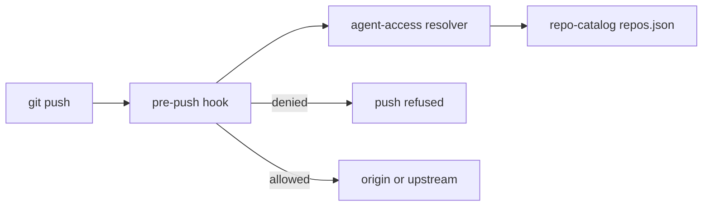

# Agent access

Agent access answers one question for one repository. How much may an AI agent do
against it? The policy is intent, and it lives in
[`repo-catalog`](https://github.com/simpsonm09-org/simpsonm09-repo-catalog). The
resolver and the push guard live here, because the standard owns enforcement.

## The level

`repos.json` carries a default per tier in `agentAccessDefaults` and an optional
`agentAccess` override on a repository. The effective level is the override when
present, otherwise the tier default. The levels, strictest first, are `none`,
`read`, `propose`, `merge`, and `full`.

## Capabilities

An enforcement point never asks for a level. It asks whether the repository grants a
capability, so the mapping from the policy to a decision lives in one table in
[`../../scripts/agent-access.mjs`](../../scripts/agent-access.mjs).

| Level | Grants |
| --- | --- |
| `none` | Nothing. |
| `read` | `read` |
| `propose` | `read`, `pushBranch`, `openPr` |
| `merge` | `read`, `pushBranch`, `openPr`, `mergePr` |
| `full` | `read`, `pushBranch`, `openPr`, `mergePr`, `pushMain`, `admin` |

## The resolver

[`../../scripts/agent-access.mjs`](../../scripts/agent-access.mjs) reads the catalog
and resolves one repository.

```bash
node scripts/agent-access.mjs simpsonm09-repo-catalog              # prints the level
node scripts/agent-access.mjs simpsonm09-browser-calculator --json # prints the level, tier, and source
node scripts/agent-access.mjs simpsonm09-repo-catalog --allows pushMain  # exits 1 when denied
```

The `--allows` mode exits `0` when the level grants the capability and `1` when it
does not, so a shell caller branches on the exit code.

## The push guard

[`../../templates/hooks/pre-push`](../../templates/hooks/pre-push) installs at
`.git/hooks/pre-push`. It reads the refs on stdin, resolves the repository from the
remote URL, and refuses a push the level does not allow. A push to `main` or a tag
needs `pushMain`, and a push to any other branch needs `pushBranch`.



## Failure modes

The guard fails closed on remote writes.

- A missing or unreadable catalog exits `2`, and the hook refuses the push.
- A missing resolver makes the hook refuse the push, with the expected path in the message.
- A repository absent from the roster resolves to `read`, so a branch push is refused.
- A remote that is not under `simpsonm09-org` is out of scope. The personal fork is a private mirror, so the guard leaves it alone.

## The agent identity

The boundary is a separate identity, a GitHub App named in
[`../../agent-app.manifest.json`](../../agent-app.manifest.json). The manifest
requests `contents`, `pull_requests`, and `workflows` at write, and `checks` and
`metadata` at read. It never requests `administration`, so the identity cannot change
settings or rulesets.

GitHub has no API to create an app, so
[`../../scripts/create-agent-app.mjs`](../../scripts/create-agent-app.mjs) drives the
manifest flow. It serves the manifest form, your browser posts it to GitHub, and
GitHub redirects a one-time code back to the script. The script exchanges the code
for the app id and the private key.

```bash
just create-agent-app
```

The script writes the private key under the user config directory, never the repo.
Move it into Infisical, where the runtime loads it as `AGENT_APP_PRIVATE_KEY` beside
`AGENT_APP_ID`.

The installation is the per-repository grant. `none` and `read` get no installation.
`propose`, `merge`, and `full` get one. `merge` adds the app to the ruleset bypass
list with mode `pull_request`, and `full` with mode `always`.

## What this does not do

The resolver and the hook are a guardrail, not a boundary. The agent still runs on
the maintainer's credential, so an agent that bypasses the hook is not stopped. The
boundary is the agent identity above, with the OpenCode gate that denies merges and
API writes. Both are tracked in the catalog roadmap.
